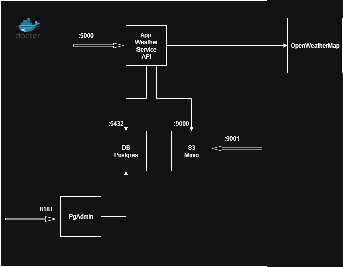

# Simple Weather API 

Application is implementation of simple Weather Service API that retrieves data from  OpenWeatherMap service.
Application takes city name as an input and provides weather information in JSON or CSV format (output is based
on request header 'Accept'. 
Weather data contains 10 fields:
- City
- Location
- Current temperature
- Feels like temperature
- Min. temperature
- Max. temperature
- Pressure in hPa
- Humidity in %
- Visibility in m
- Wind speed in m/s
- Description"
- Timestamp when this data was taken

If CSV output is requested result is stored in S3 storage(Minio) and tmp. URL is returned that can afterwards be used 
to download CSV file with data.

Each web request is persisted together with weather data in Postgres DB and can later be retrieved using web request
retrieval endpoint.

## System arhitecture

## Run app.

### Python virtual env.

App. is run solo in local python virtual env. 
Prerequisites:
- exported all required env. variables
- Minio S3 storage
- Postgres DB

Create new virtual env and activate

    python3 -n venb .venv
    source .venv/bin/activate

Install dependencies

    (venv)$ pip install -r requirements.txt

Run Flask app.

    (venv)$ python -m flask run --host=0.0.0.0

    * Debug mode: off
    
    WARNING: This is a development server. Do not use it in a production deployment. Use a production WSGI server instead.
    * Running on http://127.0.0.1:5000
    Press CTRL+C to quit
    127.0.0.1 - - [09/Aug/2025 18:58:08] "GET / HTTP/1.1" 200 -

### Docker standalone container

Both docker and docker-compose assume .env was prepared as prerequisite.

App. runs within docker container

    docker pull mslivonja/simple-weather-api:latest

    export OPENWEATHER_API_KEY=<api key>
    docker run -d \
        --name simple-weather-api \
        -p 5000:5000 \
        --restart always \
        -e OPENWEATHER_API_KEY=$OPENWEATHER_API_KEY
        simple-weather-api:latest

### Docker compse - complete stack (PREFERRED)!!!

    cat .env
    
    VERSION=<version>

    # Weather service config
    OPENWEATHER_API_KEY=<api key>

    # Minio config 
    MINIO_ACCESS_KEY=<user>
    MINIO_SECRET_KEY=<secret>

    # S3 storage service config
    S3_ENDPOINT_URL=http://localhost:9000
    AWS_ACCESS_KEY_ID=myminioadmin
    AWS_SECRET_ACCESS_KEY=myminiosecret
    S3_BUCKET=test

    # DB config
    DB_USER=mypostgresadmin
    DB_PASSWORD=myposgressecret
    DB_NAME=weather

    # PG Admin config
    PG_ADMIN_MAIL=mypgadmin@gmail.com
    PG_ADMIN_PASSWORD=mypgadminsecret

    docker-compose pull
    docker-compose up -d

App. cleanup

    docker-compose down

### REST API - Swagger UI

Access Swagger UI at http://localhost:5000/api/docs

### Weather API endpoints

Weather data URL: http://localhost:5000/weather/api/

Weather request URL: http://localhost:5000/weather/request/ap

GET request using following request

    curl -X 'GET' 'http://localhost:5000/weather/api/city/Zagreb' \
         -H 'accept: application/json'

Response is JSON formatted data.

    curl -X 'GET' 'http://localhost:5000/weather/api/city/Zagreb' \
         -H 'accept: text/csv'

Response is temp. S3 storage URL - file temp download link.

### Minio S3 Storage

S3 interface: http://localhost:9000
Browser UI: http://localhost:9001

Note: App. assumes bucket already exists. Connect to Minio browser UI at h
http://localhost:9001 and create bucket='test' manually before sending first API requeest

### Postgres DB

DB hostname: localhost
DB port: 5432

Docker compose comes with PGAdmin for DB administration. 
PGAdmin is not configured - connection needs to be setup manually

PGAdmin interface: http://localhost:8181

## Build pipeline

Gihub repository is configured with two branches 'main' & 'dev'.
'dev' branch is used for main development and feature branches are used for implementing features.
Push to branches is only allowed using PRs direct manipulation will trigger exception.
Pull request and related commits will trigger:
- static code analysis
- unit test with coverage
- docker build and push to public docker repository Dockerhub
- deploy to stage env.
- PR comment - after successful deploy

When pipeline finishes successfully and PR comment is posted reviewer can check app. on stage env.
If everything checks OK PR can be closed.
Each PR will overwrite stage env. (pipeline is not checking for conflicts), also pipeline does not clean env. or delete 
stale images from docker repository.